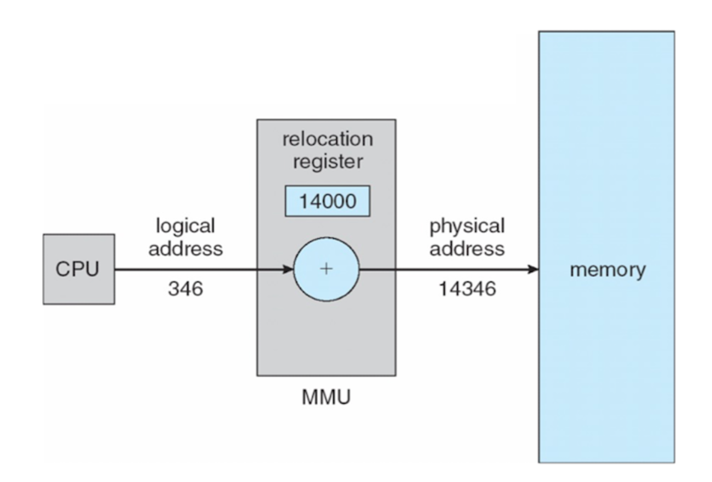

## Address Space (= 주소 공간)
- 메모리 단위 : 1Byte (= 8bit)
## Physical Address (= 물리적 주소)
- 메모리의 인덱스 
- 접근하려면 논리적 주소 -> 물리적 주소 과정(Mapping)이 필요함
## Logical Address (= 논리적 주소)
- CPU가 생성하는 주소 (= 가상주소)
- 프로세스가 쓰는 공간의 크기
### Base Register (= 시작 주소)
### Limit Register (= 크기)
### MMU (Memory Management Unit)
- Mapping 해줌 (논리적 주소에 물리적 주소를 할당)

1. Compile Time Binding
- 컴파일 때 매핑
- 프로그램 주소 = 물리적 주소 -> 멀티 프로그래밍 X
2. Load Time Binding
- 로딩 때 매핑
- 논리적 주소 != 물리적 주소 -> 멀티 프로그래밍 O
- 오버헤드 증가
- 주소를 바꿔야할 때 Relocation 해야함
3. Execution Time Binding
- 실행 시 매핑 
- Relocation이 잦기에 MMU가 필요함