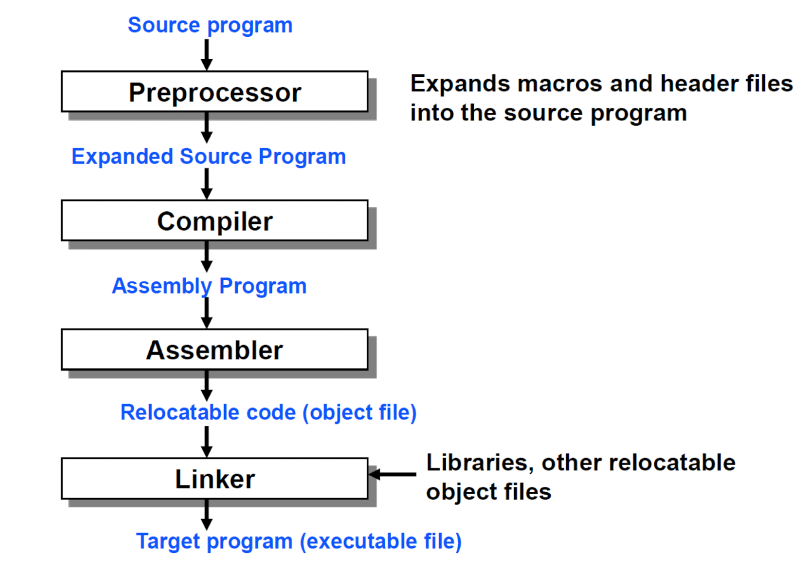

### Compile
- 원시코드 ->　기계어

1. Preprocessor
- #include, #define -> 소스코드
2. Compiler
- 위 처리에서 확장된 소스코드 -> 어셈블리어
3. Assembler
- 어셈블리어 -> 기계어
- 이 때 생성된 파일 = **Object file(목적 파일)**
4. Linker (동적 링킹)
- Object file + OS API(system call) | library = exe 실행파일(target file)
### Linking
- 정적 링킹
  - 실행 파일 내 라이브러리 포함
  - 장점 : 속도 빠름
  - 단점 : 메모리 낭비
- 동적 링킹
  - 라이브러리 함수(동적 링크 라이브러리 DLL)를 메모리에 한번만 올림
  - 함수 호출시 주소로 이동해서 다시 돌아옴
  - 장점 : 재사용성
  - 단점 : 오버헤드
### Runtime
- 사용자에 의해 응용 프로그램이 동작되는 때
- **Runtime Error** : 실행 중 오류
### Loading
- 데이터 -> 메모리
- Static Loading
  - 모든 데이터 -> 메모리
  - 메모리 낭비 심함
- Dynamic Loading
  - routine(코드의 일부분)이 call될 시 -> 메모리