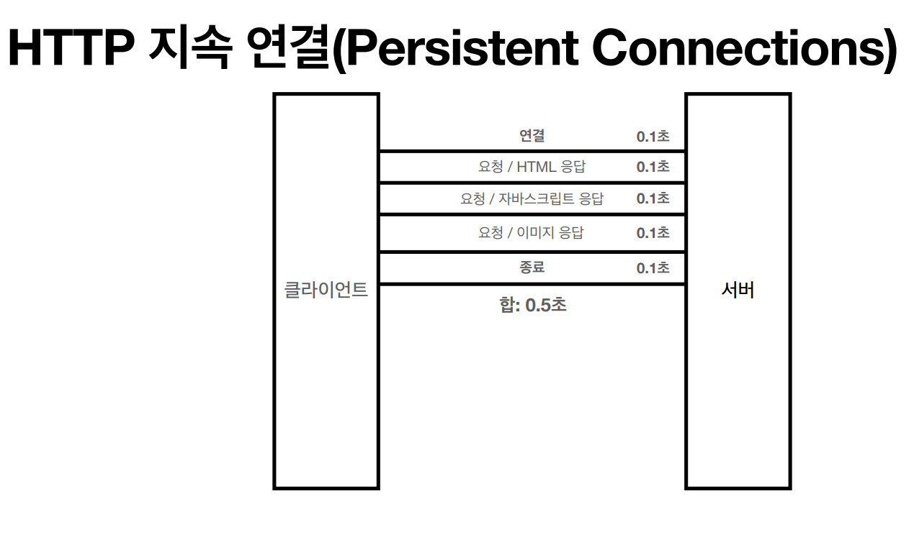
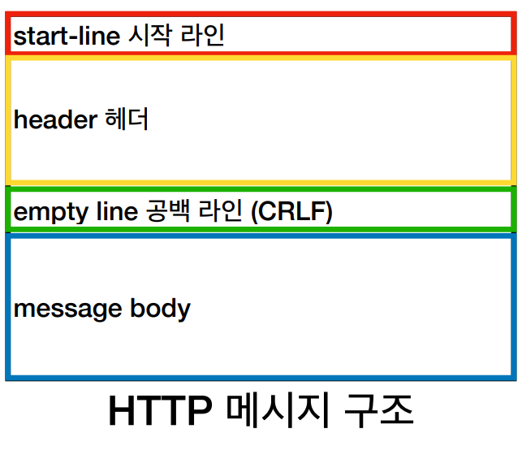
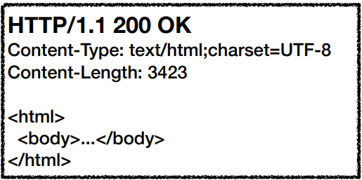

## HTTP
- image, text, html, json 등 전송 때 사용
- ### UDP : HTTP/3
- ### TCP : **HTTP/1.1**(주로 사용), HTTP/2
## 무상태 프로토콜 
### Stateless(무상태)
- 서버가 클라이언트의 상태 보존 X
- 장점 : 서버 확장성 높음
- 단점 : 클라이언트가 추가 데이터 전송
### Stateless(무상태) / Stateful(상태 유지)
- Stateless
  - 클라이언트 요청이 증가해도 서버 투입 가능
  - 응답 서버를 쉽게 바꿀 수 있음
- Stateful
  - 서버가 바뀌면 상태 정보를 보내줘야함
### connectionless(비연결성)
- 서버 자원의 효율성
- TCP/IP 새 연결 -> 3 Way Handshake 시간 추가
- 웹 브라우저에서 사이트 요청시 html, JS, css 등이 다운로드됨
- **HTTP 지속 연결(Persistent Connections)로 해결**

## HTTP Message

- ### 시작라인
  - #### Request-Line
    - start-line = **request-line** / status-line
    - request-line 
      - method SP(공백)
      - request-target SP HTTP-version CRLF(엔터)

    

  - #### Status-Line
    - start-line = request-line / **status-line**
    - status-line = HTTP-version SP status-code SP reason-phrase CRLF
    - HTTP 상태 코드
      - 200 : 성공
      - 400 : 클라이언트 오류
      - 500 : 내부 서버 오류

    