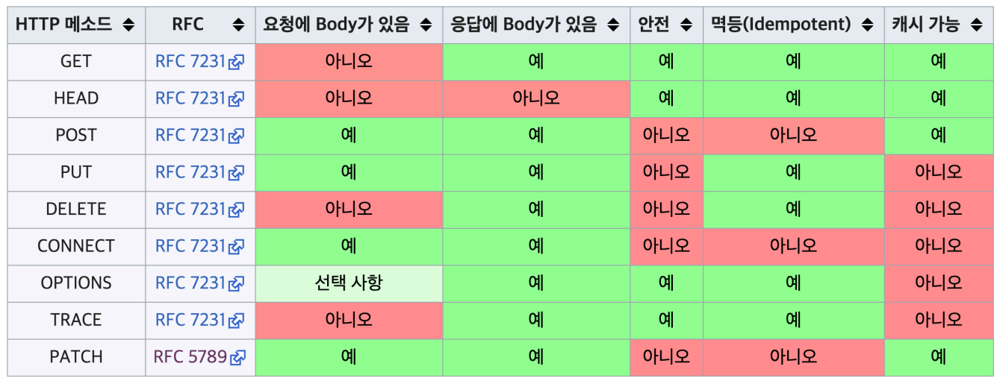

## Method

- 안전 : 호출해도 리소스 변경 X
- 멱등 : 여러번 호출해도 결과가 같음
- 캐시가능 : 응답 결과 리소스를 캐시해 사용 가능 (실제론 GET, HEAD정도만 사용)

- ### GET : 리소스 조회
  - 서버에 전달하고픈 데이터는 query로 통해 데이터 전달 가능
- ### POST : 요청 데이터 처리, 등록에 자주 사용
  - 서버에 전달하고픈 데이터는 Message Body로 통해 데이터 전달 가능
- ### PUT : 리소스 대체, 리소스가 없을 시 리소스 생성
  - 클라이언트가 리소스 위치를 알고 URI 지정
- ### PATCH : 리소스 부분 변경
- ### DELETE : 리소스 삭제   
### --- 기타 메서드 ---
- HEAD : 메세지 부분 없는 GET
- OPTIONS : 리소스에 대한 통신 가능 옵션을 설명
- CONNECT : 리소스로 식별되는 서버에 대한 터널 설정
- TRACE : 리소스 경로에 따라 메세지 루프백 테스트 수행
## 클라이언트에서 서버로 데이터 전송
- ### query 전송
  - GET
  - 주로 필터에 쓰임
- ### message body 전송
  - POST, PUT, PATCH
  - 회원가입, 리소스 등록, 변경 등
- ### HTTP Form 전송
  - HTML Form submit -> POST 전송 (예: 회원가입)
- ### HTTP API 전송
  - 서버 to 서버
  - 앱 클라이언트
  - 웹 클라이언트
  - POST, PUT, PATCH : 메세지 바디로 데이터 전송
  - GET : 쿼리 파라미터로 전송
  - 주로 JSON 사용