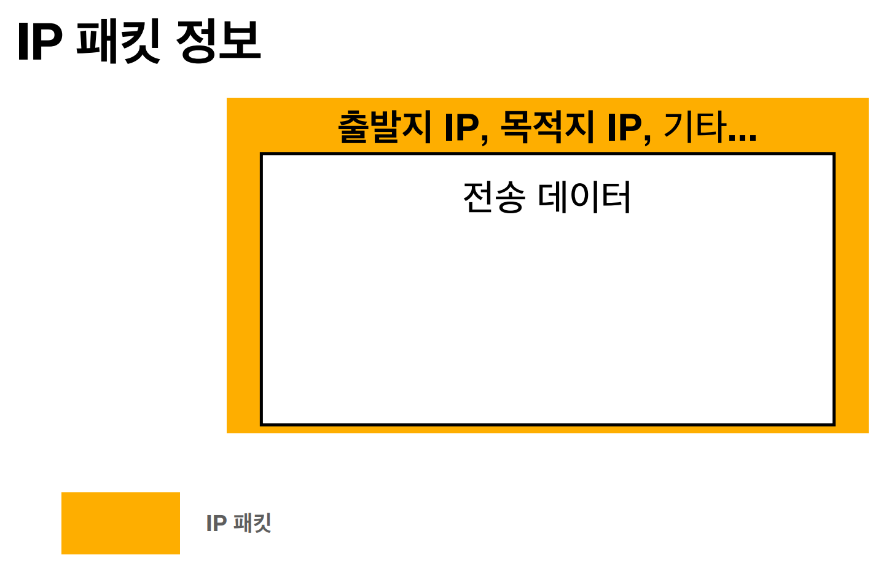
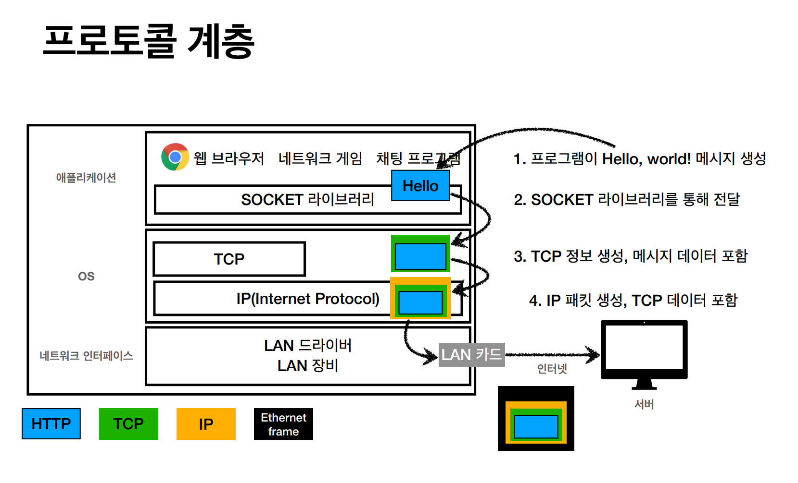
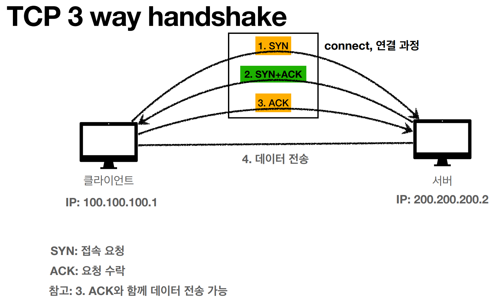
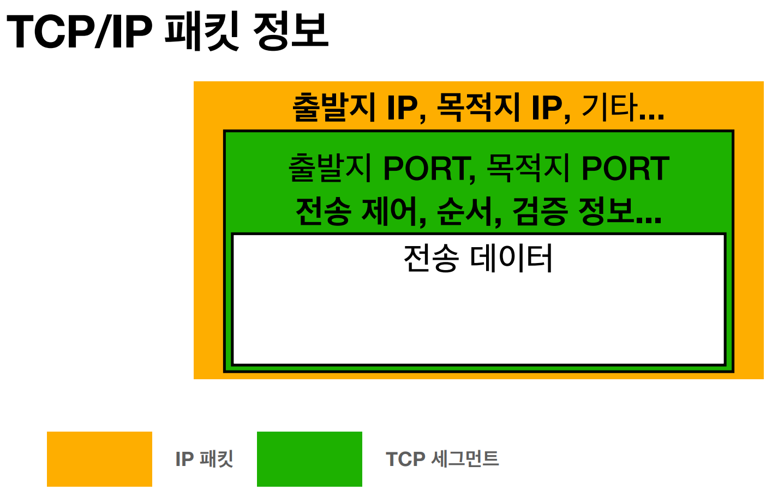
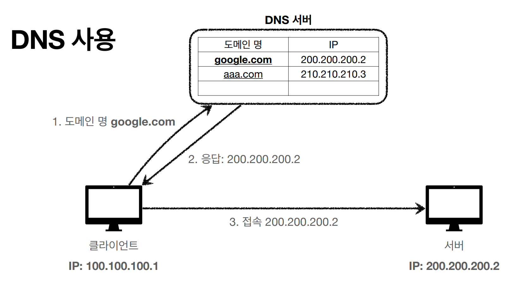

## 역할
- 지정한 IP 주소에 **Packet**(통신단위)로 데이터 전달

## 한계
- **비연결성** : 목적지가 없거나 서비스 불능 상태에도 패킷 전송
- **비신뢰성** : 중간에 패킷 사라지거나 절차대로 안올 가능성
- **프로그램 구분** : 같은 IP를 사용하는 서버에 통신하는 어플리케이션이 다수일 가능성
## 스택의 4계층
- ### 애플리케이션 (HTTP, FTP)
- ### 전송 계층 (TCP, UDP)
- ### 인터넷 계층 (IP)
- ### 네트워크 인터페이스 계층

## TCP 
- 연결지향 - **3 way handshake(가상연결)**
- 데이터 전달 보증
- 순서 보장

### TCP Packet

### PORT
- 0 ~ 65535 : 할당 가능 
- 0 ~ 1023 : 사용 안하는걸 권장
- FTP : 20, 21
- TELNET : 23
- HTTP : 80
- HTTPS : 443
## DNS 
- 도메인 명 -> IP 주소로 변환        

