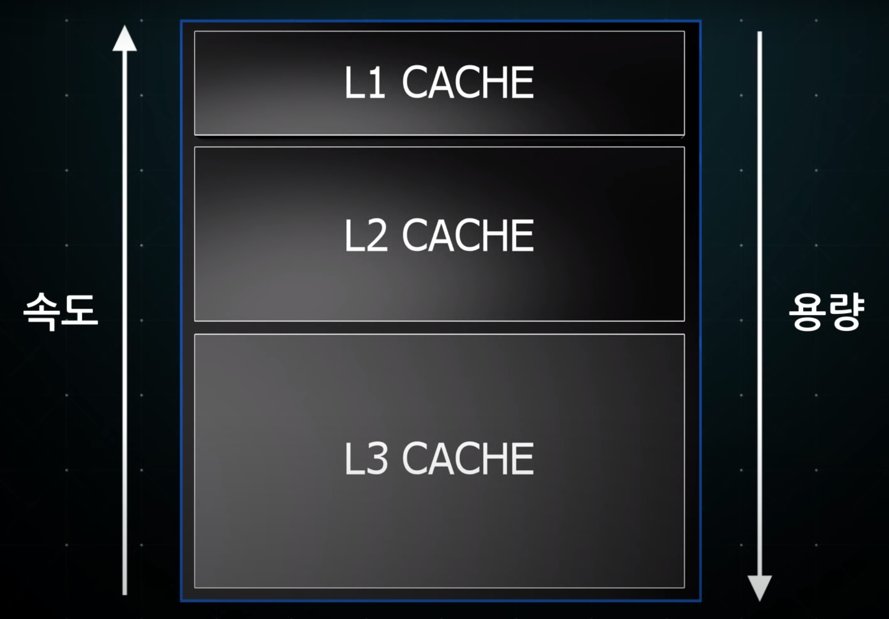
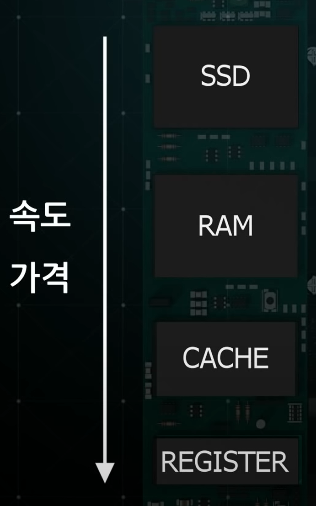

## SSD
## RAM
## CACHE
- CPU 내부나 외부에 있음
- 1, 2, 3 레벨로 나눠져있음
  
- 1 -> 2 -> 3 -> RAM 순으로 데이터를 읽음
## REGISTER
- CPU 내부에서 데이터 일시적 저장
- 
- **프로그램 카운터** 
  - 다음에 수행할 메모리 주소를 담음
- **메모리 주소 레지스터** 
  - 프로그램 카운터 주소 받고 버퍼한테 넘김
- **메모리 버퍼 레지스터**  
  - 메모리 주소 데이터 일시 저장 (= 인출과정)
  - 최종 결과를 메모리에 보냄
  - 데이터가 **명령이면 명령어 레지스터**에 보냄
  - 데이터가 **연산이면 누산기 레지스터**에 보냄
- 제어장치
  - 명령어 레지스터의 명령어 해석 
  - 명령을 실행시킴
- ALU
  - 산술, 논리, 연산