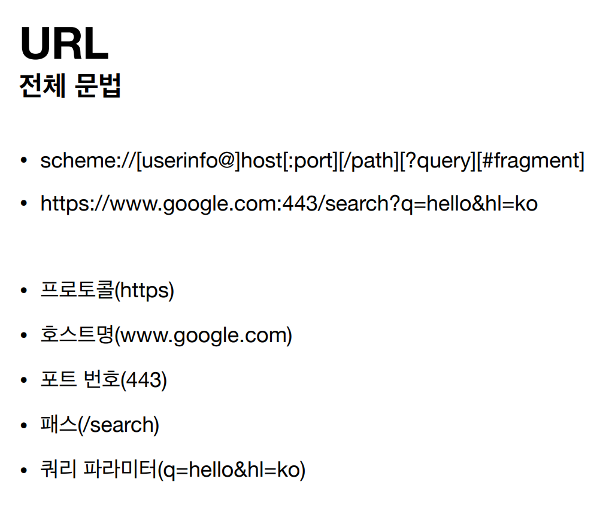

## URI (Uniform, Resource, Identifier)
### URL (Locator)
- 리소스의 위치 지정
- 위치 변할 수 있음

   
- ### scheme
    - 프로토콜 사용 (http, https, ftp)
- ### userinfo
  - URL에 사용자 정보를 포함하는 인증
  - 사용 잘 안함
- ### host
  - 호스트명 
  - 도메인명 OR IP 주소를 직접 사용
- ### PORT (생략 가능)
  - 접속 포트
  - http : 80 PORT 
  - https : 443 PORT 
- ### path
  - 리소스 경로
- ### query
  - KEY = VALUE
  - ?로 시작, &으로 추가
  - query parameter, query string 등으로 불림
- ### fragment
  - #으로 시작
  - 서버에 전송 X
  - html 내부 북마크 등에 사용
### URN (Name)
- 리소스에 이름 부여
- 이름 변할 수 없음